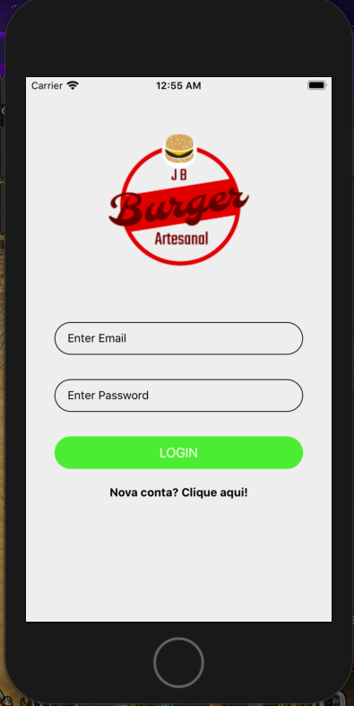
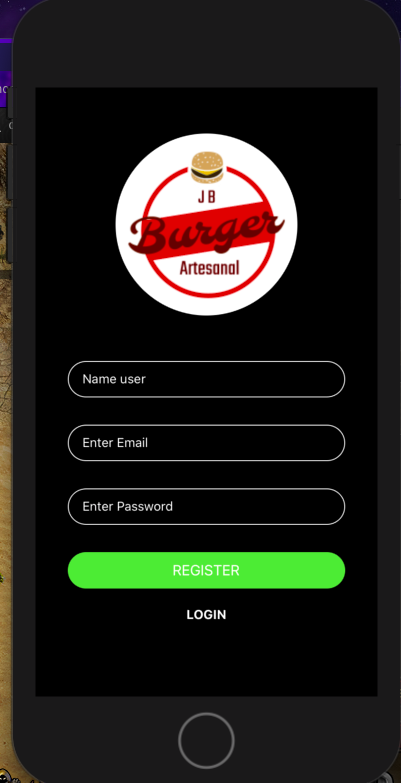
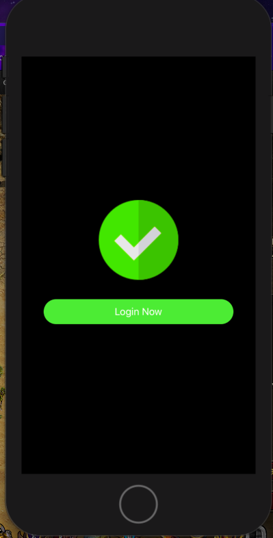
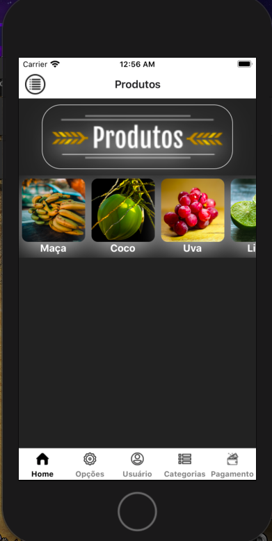
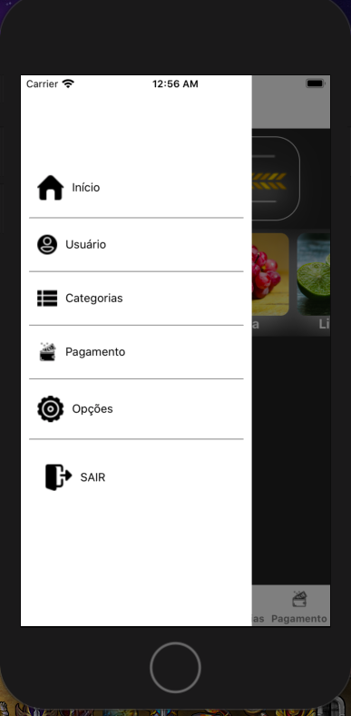

# Template React-Native 0.62

Tamplate with, StackNavigator, Drawer Navigator, Tab Navigator.

Icons whit image.

//
//
//
//
//

Bottom Elevation effect

const App = () => {
  const NeuMorph = ({children, size, style}) => {
    return (
      <View style={styles.topShadown}>
        <View style={styles.bottomShadown}>
          <View
            style={[
              styles.inner,
              {
                width: size || 40,
                height: size || 40,
                borderRadius: size / 2 || 40 / 2,
              },
              style,
            ]}>
            {children}
          </View>
        </View>
      </View>
    );
  };
